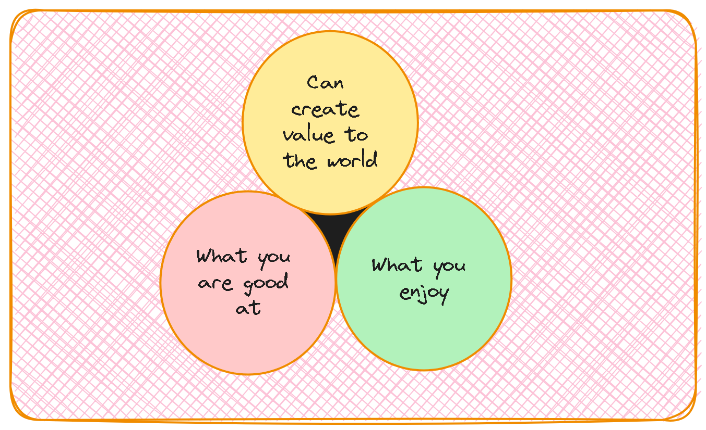

  

# Are you doing good?
To ensure that you are doing good in your personal and professional life, it is essential to find the intersection of three key aspects:

1. **What You Are Good At**
2. **What You Enjoy**
3. **Can Create Value to the World**

### What You Are Good At

Identify your skills and strengths. These are the activities and tasks that you perform well, often with a level of proficiency that others recognize. Here are some steps to help you discover what you are good at:

- **Reflect on past successes:** Think about times when you excelled in a task or project.
- **Seek feedback:** Ask colleagues, friends, or mentors for their input on your strengths.
- **Take assessments:** Consider taking skill or personality assessments to get a clearer picture of your abilities.

### What You Enjoy

Passion and enjoyment are crucial for sustained satisfaction. These are the activities that you find fulfilling and that bring you joy. To discover what you enjoy, consider the following:

- **Identify hobbies and interests:** Think about what you love to do in your free time.
- **Notice when you lose track of time:** Activities that make you lose track of time are often those that you enjoy.
- **Experiment:** Try new activities and experiences to see what resonates with you.

### Can Create Value to the World

Your skills and passions must also create value to be meaningful in a broader context. This is about making a positive impact, whether it’s through your job, volunteering, or other contributions. To identify how you can create value, consider:

- **Understanding needs:** Look for problems that need solving in your community or industry.
- **Leveraging your strengths:** Use your skills and what you enjoy to address these needs.
- **Seeking opportunities:** Find roles or projects that align with your skills and passions while benefiting others.

### The Intersection: Doing Good

When you find the sweet spot where all three aspects intersect, you are in a place where you can do good effectively. This intersection signifies that you are:

- **Utilizing your strengths,** ensuring you are effective and efficient in your tasks.
- **Engaged and passionate,** which keeps you motivated and prevents burnout.
- **Making a positive impact,** which provides a sense of purpose and fulfillment.

By continuously evaluating and aligning these three aspects, you can ensure that you are on a path of doing good and making a difference. Whether in your career, personal projects, or volunteer work, this holistic approach will help you thrive and contribute meaningfully to the world.
Remember, doing good is an ongoing process. Regularly revisit these aspects to adapt and refine your path as you evolve and as the world changes around you.

